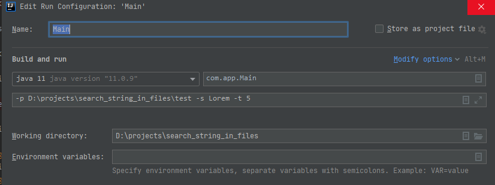

# search_string_in_files

Search for a string in files is application which can be used to search for a string in files.\
[Download jar](https://github.com/benomarek/search_string_in_files/blob/master/string_finder.jar).

## Required:

-java 11

>## Arguments:
>-p : path to file or folder\
>-s : string to be searched - max 128 chars\
>-t : (optional) number of threads used for search

## Run
### Example
-jar:
>java -jar string_finder.jar -p path -s searched_string -t num_of_threads

-IDE:\

